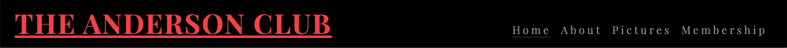

# The Anderson Club

This project is a fantasy based project which provides value as a professional website framework
for clubs, bars, pubs, organizations etc. The website gives a simple readable & responsive data structure framework that can be adjusted which solves issues amongst the companies in the mentioned industries where i've seen a lack of quality in terms of visual experience and responsiveness.

## Features

## Navigation

* At the top of page in the left corner you can find the club name with a text decoration of underline and in the right corner you will find the navigation links to: Home, About, Pictures and Membership.

* The navigation bar is featured on all 4 pages.

* The colors and font style in the header is inspired by Mafia themes since they were a society back in the days who enjoyed clubs.

## The landing page image

* The landing page includes an image with a white text overlay background with red text included in it to make the website look a bit better and professional.

## Section of benefits

* This section gives any users who considers to become a member some important benefits why The Anderson Club could benefit them.

* Each h2 element contains one font awsome icon which matches the text description.

* Each text line also contains a hr element to make the text look more fulfilling and dyslectic friendly.

## Opening hours and seminar info

* This information tells the user where the club is located, 

## The About Page

* The about page tells a story about an invented fantasy character called Mr Allen Andersson where you can see an image of that fantasy person.

* I have also included a link in the about page to wikipedia.org where i pretended that people can read more about this person in order to show more of my abilities.

## Apply Membership Form

* In this form i kept it as simple as posible since i like clean designs. In the form you can find inputs where a user needs to fill in their: First Name, Last Name, Email Adress, Job Title and radio buttons were the user need to choose an option if they want a private parking.

* On the h2 element you can find a font awsome icon which i feel matches the purpose of the form.

* On the bottom of the form you can find a submit button which i gave a border radius property in the css file for the purpose to showcase my abilities a little bit more but i feel that a submit button with sharp edges would probably look better.

## Credit

* The majority of the total code was taken from or inspired by the CI Love Running Project. 

## Media

* All the images were taken from the website Pexels.

* All the icons used in the code was taken from font awsome.

