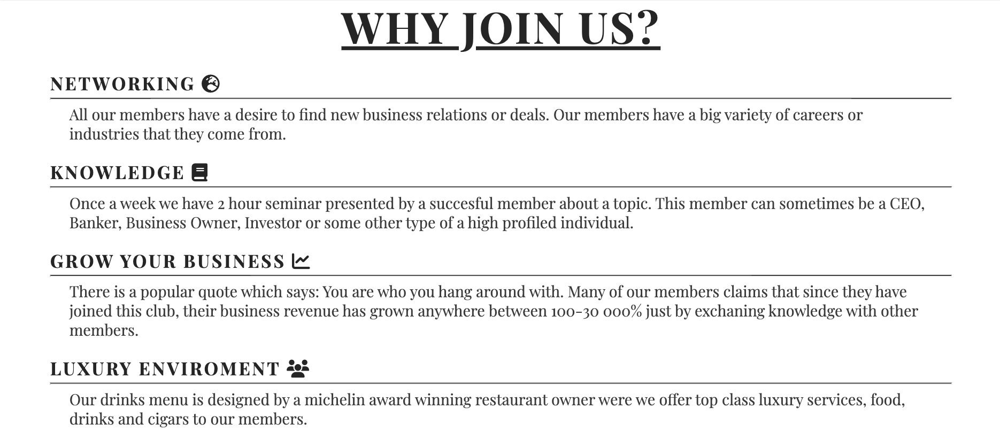

# The Anderson Club

This project is a fantasy based project which provides value as a professional website framework
for clubs, bars, pubs, organizations etc. The website gives a simple readable & responsive data structure framework that can be adjusted which solves issues amongst the companies in the mentioned industries where i've seen a lack of quality in terms of visual experience and responsiveness.

The deployed website version can be found on this url adress: https://thomasottosson.github.io/Newpub/index.html

## Features

Navigation

* At the top of page in the left corner you can find the club name with a text decoration of underline and in the right corner you will find the navigation links to: Home, About, Pictures and Membership.

* The navigation bar is featured on all 4 pages.

* The colors and font style in the header is inspired by Mafia themes since they were a society back in the days who enjoyed clubs.

## The landing page image

* The landing page includes an image with a white text overlay background with red text included in it to make the website look a bit better and professional.

## Section of benefits

* This section gives any users who considers to become a member some important benefits why The Anderson Club could benefit them.

* Each h2 element contains one font awsome icon which matches the text description.

* Each text line also contains a hr element to make the text look more fulfilling and dyslectic friendly.

## Opening hours and seminar info

* This information tells the user where the club is located, opening hours and days for the club, restaurant opening hours and days and when the seminar are scheduled.

* The text contains with two h3 elements where each h3 element has it's own font awsome icon.

* The seminar info and opening hours info has two different indivdual background images with some dark opacity added to them.

## Footer

* The footer tells the user where they can find the social media pages for The Anderson Club and that inlcudes buttons with links to each relevant social media page. 

* The colour for the footer is white on the background and the colour for the social media buttons are black.

* This footer is included in all four pages.

## The About Page

* The about page tells a story about an invented fantasy character called Mr Allen Andersson where you can see an image of that fantasy person.

* I have also included a link in the about page to wikipedia.org where i pretended that people can read more about this person in order to show more of my abilities.

## Pictures

* The pictures page will provide the user a good understanding how the club looks and what's available in terms of quality.

* Since membership for this club is expensive, it's very value for the user to see online what their money would go towards.

## Apply Membership Form

* In this form i kept it as simple as posible since i like clean designs. In the form you can find inputs where a user needs to fill in their: First Name, Last Name, Email Adress, Job Title and radio buttons were the user need to choose an option if they want a private parking.

* On the h2 element you can find a font awsome icon which i feel matches the purpose of the form.

* On the bottom of the form you can find a submit button which i gave a border radius property in the css file for the purpose to showcase my abilities a little bit more but i feel that a submit button with sharp edges would probably look better.

## Features left to improve the website

* Add a description to each image on the pictures page.

* Add a background image to membership page.

* Add a hover function to the social media buttons.

* Adjust the logo and navigation so the logo becomes a little larger.

* Add a shop to the club so any users can buy merch or tickets for the seminar.

## Validator Testing 

The HTML and CSS code has been validated through:

* W3C Validator(HTML): https://validator.w3.org/nu/ 

* Jigsaw Validator(CSS): https://www.w3.org/

* My CSS Results: https://jigsaw.w3.org/css-validator/validator

### Overall tests

* Lighthouse results: 

* Amiresponsive results: 

Here is a link to the results: https://ui.dev/amiresponsive?url=https://thomasottosson.github.io/Newpub/index.html

## Unfixed bugs

* The perfomance in lighthouse needs to be a little bit improved with for example adjusting the size of the images and making their file size smaller so the website becomes faster to load.

## Deployment

* The deployment was made through github. The step by step process where the following: Settings --> Pages --> Source --> Deploy from a branch --> Main --> /(root) --> Save.

## Credit

* The majority of the total code was taken from or inspired by the CI Love Running Project created by Code Institute. 

* Here is a url adress to check out their homepage: https://codeinstitute.net/

* Here is a url adress to check out the codes i used from github: https://github.com/Code-Institute-Solutions/love-running-v3/tree/main/8.1-testing-and-validation

## Media

* All the images were taken from the website Pexels. Here is a url adress to their homepage: https://www.pexels.com/

* All the icons used in the code was taken from font awsome. Here is a url adress to their homepage: https://fontawesome.com/ 

